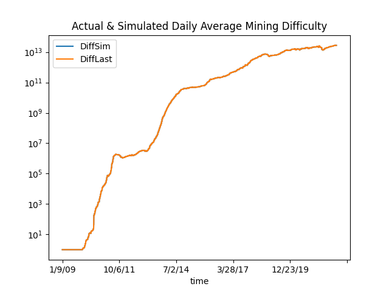

# Block Time Simulator
A framework to simulate and test control algorithms for PoW block time.

## Introduction
This tool can be used to accurately back-test and predict block time or block generation rate
only using hash rate data and its corresponding timestamp (e.g. daily average hash rate).

## Bitcoin Test Results
Using this framework to simulate the daily block generation and daily average mining difficulty against 
the actual historical data as shown below.

The MSE of block count is 2.70 blocks daily.

The MSE of difficulty is 2.33%

## Data Source
The daily hash rate is the sum of hash rate of all major mining pools.
* The Bitcoin hash rate of mining pools and difficulty data is from:
https://coinmetrics.io